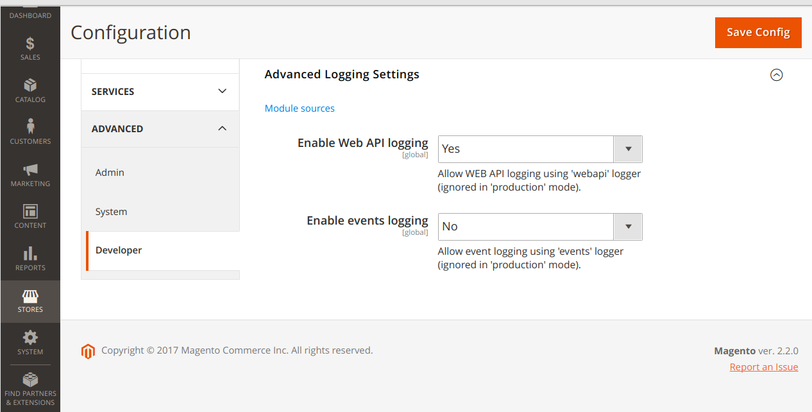

# mage2_ext_log

Add Monolog Cascade support to Magento 2.

## Overview

This module replaces ` \Magento\Framework\Logger\Monolog` class 
(default implementation of the `\Psr\Log\LoggerInterface`) with own implementation that allows to use separate files
for logs.

`./etc/di.xml`:

```xml
    <preference for="Psr\Log\LoggerInterface"
                type="Flancer32\Logging\Logger"/>
```

`\Flancer32\Logging\Logger` class uses a `\Cascade\Cascade` to create Monolog loggers according to 
configuration file (see [theorchard/monolog-cascade](https://github.com/theorchard/monolog-cascade)) or
uses a default Magento 2 logger (`\Magento\Framework\Logger\Monolog`) if no logging configuration
file found.

Default configuration file should be placed in `./var/log/logging.yaml`.

Additionally, there are 2 options to log Web API requests/responses and events in development/default mode.


## Installation

```bash
$ cd ${DIR_MAGE_ROOT}   // go to Magento 2 root folder ('composer.json' file should be placed there)
$ composer require flancer32/mage2_ext_log
$ bin/magento module:enable Flancer32_Logging
$ bin/magento setup:upgrade
$ bin/magento setup:di:compile

```


## Logging Configuration

This is a sample configuration file `./var/log/logging.yaml`:

```yaml
disable_existing_loggers: true
formatters:
    dashed:
        class: Monolog\Formatter\LineFormatter
        format: "%datetime%-%channel%.%level_name% - %message%\n"
handlers:
    fileApi:
        class: Monolog\Handler\StreamHandler
        level: DEBUG
        formatter: dashed
        stream: /path/to/mage/var/log/api.log
    fileApp:
        class: Monolog\Handler\StreamHandler
        level: DEBUG
        formatter: dashed
        stream: /path/to/mage/var/log/app.log
    fileDebug:
        class: Monolog\Handler\StreamHandler
        level: DEBUG
        formatter: dashed
        stream: /path/to/mage/var/log/debug.log
    fileEvents:
        class: Monolog\Handler\StreamHandler
        level: DEBUG
        formatter: dashed
        stream: /path/to/mage/var/log/events.log
    fileSystem:
        class: Monolog\Handler\StreamHandler
        level: INFO
        formatter: dashed
        stream: /path/to/mage/var/log/system.log
    email:
        class: Monolog\Handler\NativeMailerHandler
        to:
            - info@flancer.lv
        subject: Magento app error
        from: noreply@host.com
        level: CRITICAL
        formatter: dashed
loggers:
    app:
        handlers: [fileApp, email]
    events:
        handlers: [fileEvents]
    main:
        handlers: [fileDebug, fileSystem]
    webapi:
        handlers: [fileApi]
```


## Module Configuration

See `Store / Configuration / Advanced / Developer / Advanced Logging Settings`:



Attention: section `Store / Configuration / Advanced / Developer` is available in `developer` mode only:

```bash
$ ./bin/magento deploy:mode:set developer
```